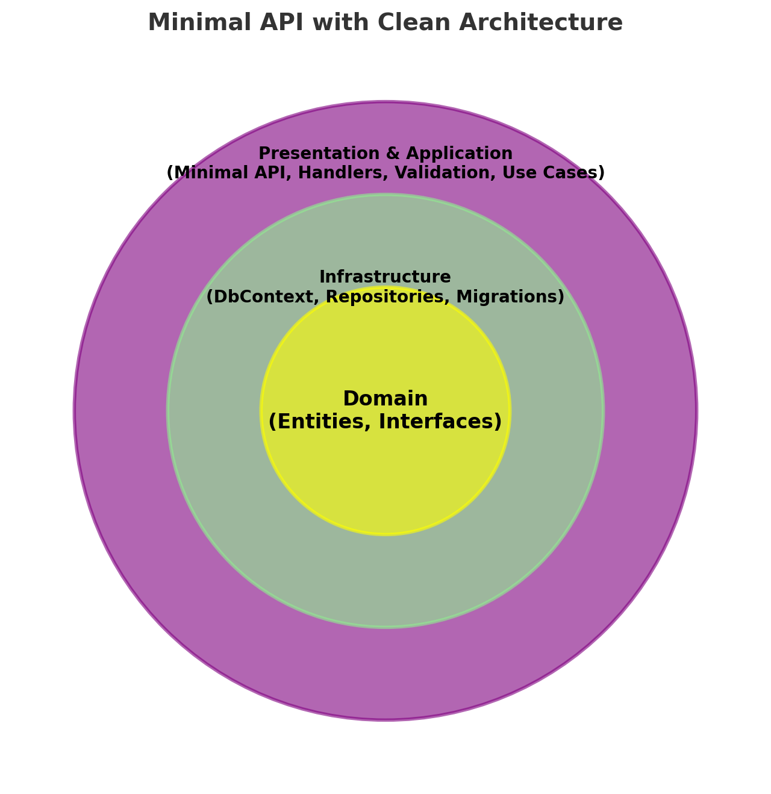

# Minimal API with Clean Architecture


## Overview
This project is a streamlined implementation of Clean Architecture using Minimal APIs. Unlike traditional Clean Architecture implementations where the Application and Presentation layers are strictly separated, this approach simplifies the structure by having the API project handle both layers. The goal is to keep the solution lean while maintaining the benefits of Clean Architecture.

## What is Minimal API?
Minimal API is a lightweight approach to building APIs in ASP.NET Core. It removes the overhead of controllers and configurations, allowing you to define endpoints with minimal code.

Example:
```csharp
var builder = WebApplication.CreateBuilder(args);
var app = builder.Build();
app.MapGet("/", () => "Hello World");
app.Run();
```

For more details, check the [Microsoft documentation](https://learn.microsoft.com/en-us/aspnet/core/fundamentals/minimal-apis/overview?view=aspnetcore-8.0).

## Clean Architecture
Clean Architecture organizes code into distinct layers to improve maintainability and scalability. 


## Project Architecture
This project follows a pragmatic approach where the API integrates both the Application and Presentation layers while still ensuring a clear separation of concerns.



## Patterns Used
- **CQRS (Command and Query Responsibility Segregation)**
- **Mediator Pattern**
- **Repository Pattern**
- **Unit of Work**

## Project Structure
The project follows a structured approach to maintain code organization and clarity:
```
📦 MinimalApiCleanArchitecture
 ┣ 📂 src
 ┃ ┣ 📂 Domain (Domain models, Business Logic)
 ┃ ┣ 📂 Infrastructure (Data Access, External dependencies)
 ┃ ┣ 📂 API (Minimal API Endpoints & Application concerns)
 ┗ 📂 tests (Unit and Integration Tests)
```

## Running the Project
### Using Docker
Run the following command to start the API using Docker:
```bash
docker compose up --build
```
Then, access Swagger at:
```
http://localhost:8080/swagger
```

### Running Locally
#### Prerequisites
- [.NET 8.0 SDK](https://dotnet.microsoft.com/en-us/download/dotnet/8.0)

#### Install Dependencies
```bash
dotnet restore
```

#### Build the Project
```bash
dotnet build
```

#### Run the API
```bash
cd src/API
 dotnet run
```
Access Swagger at:
```
https://localhost:7054/swagger
```
> If HTTPS is required, trust the .NET dev certificate:
```bash
dotnet dev-certs https --trust
```

## Dependencies
### Infrastructure Layer
- [AutoMapper](https://www.nuget.org/packages/automapper/) - `dotnet add package AutoMapper --version 13.0.1`
- [FluentValidation](https://www.nuget.org/packages/FluentValidation.DependencyInjectionExtensions) - `dotnet add package FluentValidation.DependencyInjectionExtensions --version 11.9.0`
- [MediatR](https://www.nuget.org/packages/MediatR) - `dotnet add package MediatR --version 12.2.0`
- [SQLite](https://www.nuget.org/packages/Microsoft.EntityFrameworkCore.Sqlite/) - `dotnet add package Microsoft.EntityFrameworkCore.Sqlite --version 8.0.4`

### API Layer
- [OpenAPI](https://www.nuget.org/packages/Microsoft.AspNetCore.OpenApi/) - `dotnet add package Microsoft.AspNetCore.OpenApi --version 8.0.4`
- [EntityFrameworkCore.Design](https://www.nuget.org/packages/Microsoft.EntityFrameworkCore.Design/) - `dotnet add package Microsoft.EntityFrameworkCore.Design --version 8.0.0`
- [Swagger (Swashbuckle)](https://www.nuget.org/packages/Swashbuckle.AspNetCore/) - `dotnet add package Swashbuckle.AspNetCore --version 6.4.0`

## References
- [ASP.NET Core Minimal APIs](https://learn.microsoft.com/en-us/aspnet/core/fundamentals/minimal-apis/overview?view=aspnetcore-8.0)
- [Clean Architecture](https://blog.cleancoder.com/uncle-bob/2012/08/13/the-clean-architecture.html)

## License
[](./LICENSE)

